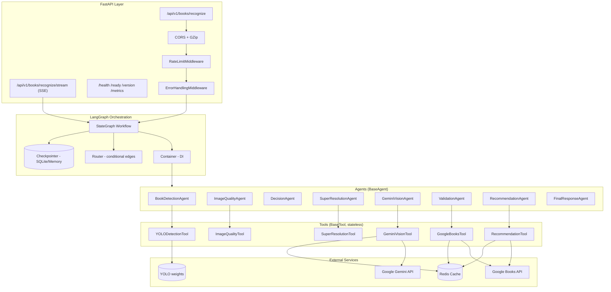
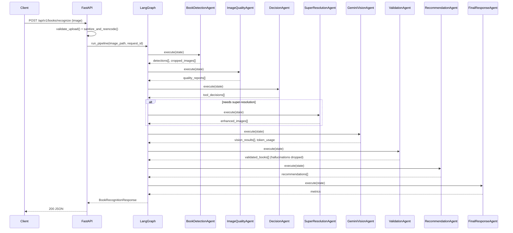

# Architecture

## 1. Overview

The system is a LangGraph `StateGraph` of eight agents, each wrapping one or
more stateless tools. State flows through a single typed `PipelineState`
(Pydantic-backed `TypedDict`) using LangGraph's reducer mechanism for
append-only fields (`execution_trace`, `errors`, `warnings`, `token_usage`).

## 2. Component diagram

## 3. Sequence diagram — happy path

## 4. State model

`app/models/state.py::PipelineState` is the single contract threaded through
every node. Append-only fields use `Annotated[list[T], operator.add]` so
LangGraph merges partial node returns instead of overwriting history.
Agents therefore return **deltas**, not the full state — see the docstring
in `app/agents/base_agent.py` for the reducer-safety contract.

## 5. Routing logic

Implemented in `app/graph/router.py`, unit-tested in isolation from the
graph:

- `route_after_detection`: skip straight to `final_response` if YOLO found
  nothing.
- `route_after_decision`: send to `super_resolution` only if at least one
  crop needs it; skip straight to `gemini_vision` otherwise; skip both if
  every crop was rejected on quality.
- `route_after_validation`: skip `recommendation` if nothing survived
  Google Books validation.

## 6. Failure isolation

`BaseAgent.execute()` never lets an agent's exception propagate into the
graph. It's caught, logged with full context, recorded as a failed
`ExecutionStep` and an `errors` entry, and the graph continues — so a
transient Gemini outage degrades gracefully to a partial response (with
`status: "failed"` or `"partial_success"` in the API response) rather than
a 500.

## 7. Extending the pipeline

To add a new agent/stage:

1. Add any new tool under `app/tools/`, inheriting `BaseTool`.
2. Add the agent under `app/agents/`, inheriting `BaseAgent`, returning a
   partial-state delta from `run()`.
3. Register the tool + agent in `app/graph/container.py`.
4. Add the node + edges in `app/graph/workflow.py`.
5. If it needs new routing, add a function to `app/graph/router.py` and a
   unit test in `tests/unit/test_router.py`.
